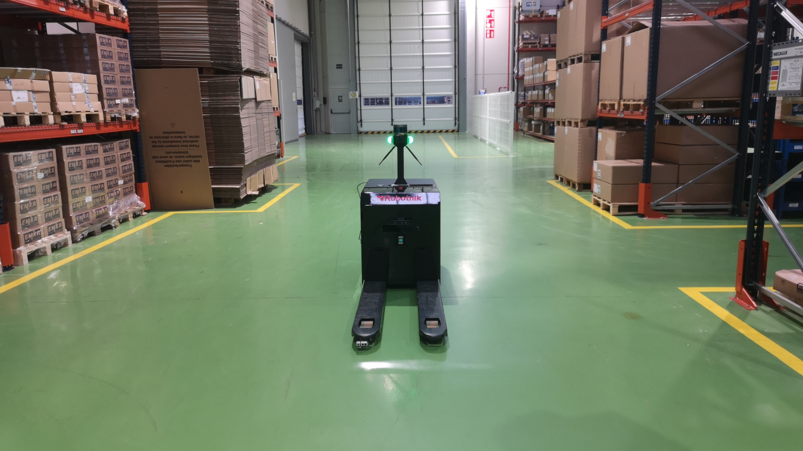
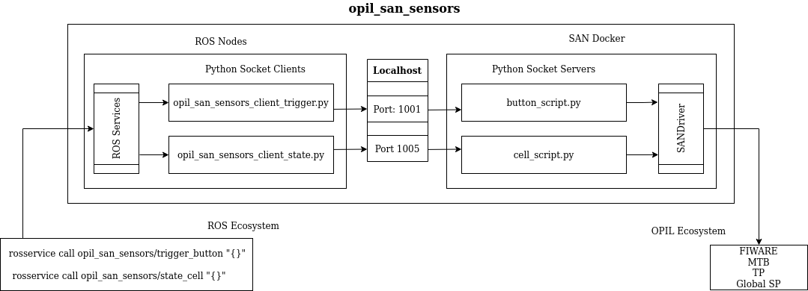
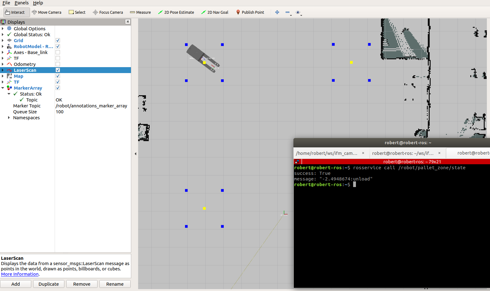
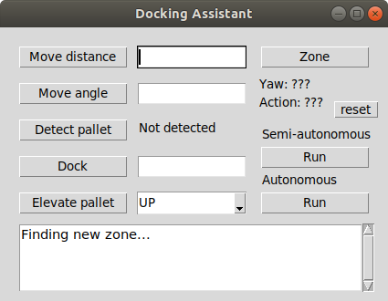

# opil_riogistics

**Description:** this repository contains the software developed in the L4MS project for the integration of the rbares robot in the EMKA factory using OPIL. 

# Overview

## rbares in EMKA



## General structure of packages


## rbares loading a pallet speed x2


# General Requirements

* Ubuntu 18.04 
* ROS Melodic
* Python 2.7
* Real or simulated robot
* rbares packages (included as submodule) 
* Docker and docker compose
* L4MS docker images
* Robotnik packages (provided as .deb libraries)


# Main installation

Clone and build this repository in a ROS workspace. This documentation assumes that ```catkin_ws``` workspace has been created in  ```/home``` directory

```
$ cd ~/catkin_ws/src
$ git clone https://github.com/robert-ros/opil_riogistics.git
$ cd ..
$ catkin_make
$ source devel/setup.bash
```


# Packages

## opil_local_server

In this folder the configuration files are provided to start the docker that contains the OPIL Server. 

```
$ cd opil_riogistics/opil_local_server
```

Before to run the docker, set the IP address of the machine where the server will run. Use ```hostname -I``` to get the IP and replace ```<ip-address>``` with that IP in these files:

**docker-compose.yml in lines 58 and 60**

```
    - ocb_host=<ip-address>
    - ocb_port=1026
    - ngsi_proxy_host=<ip-address>
    - ngsi_prox...
```

**firos_config.json in lines 9 and 18**

```
    "contextbroker": {
        "address"   : "<ip-address>",
        "port"      : 1026,
        "subs...

    "endpoint": {
      "address": "<ip-address>",
      "port": 39...
    
```

**ts_fiware_config.ini in line 9**

```
[contextbroker]
host = 192.168.1.14
port = 10...
```

Once configured these files the docker server can be started. Enable xhost to display the windows created by the OPIL server (this step is optional)

```
$ xhost local:root
```

Finally, run the docker

```
$ docker-compose up
```

If everything went well, two rviz windows will display. The first shows the route and the annotations while the seconds shows the footprint of each point of the route.  


Do not worry if MTB shows the following error at first. It means that MTP look the map but can not find because the map is generating still. Eventually MTB will show something like ```mtp_1 | 172.19.0.1 - - [15/Dec/2020 12:24:39] "POST / HTTP/1.1" 204 - ```


To access the HMI open a web browser and introduce the IP of the OPIL Server:

```
http://<ip-address>/main
```

If the OPIL Server and the web browser are running in the same machine, another option is to access the localhost: 

```
http://localhost/main
```

Introduce the following credentials to access as admin

```
admin: admin
password: admin
```


A map is needed to monitor the robots running with the OPIL Server. Go to ```opil_local_server/emka_map.png``` and upload the image into the server.

Use this configuration:
```
Select floor plan: emka_map.png
Floor plan name: emka_map
Scale: 0.05
X-offset: 0
Y-offset: 0
```


In the control tab add the following virtual buttons 

```
- fillRawMaterialButton
- fillProcessedMaterialButton
- loadCompleted
- unloadCompleted
```


Finally, fill inside the Task Management tab the task of the rbares robot. Go to ```opil_local_server/opil_tasks``` and copy-paste it. 

```
# Definitions of the zones

Location pallet_a
    name = "pallet_a"
    type = "SmallLoadCarrier"
end

Location pallet_b
    name = "pallet_b"
    type = "SmallLoadCarrier"
end

Location pallet_c
    name = "pallet_c"
    type = "SmallLoadCarrier"
end

Location pallet_d
    name = "pallet_d"
    type = "SmallLoadCarrier"
end


# Button events

Event triggerFillRawMaterial
    name = "fillRawMaterialButton"
    type = "Boolean"
end

Event triggerFillProcessedMaterial
    name = "fillProcessedMaterialButton"
    type = "Boolean"
end

# Actions events (a button is used)

Event robotLoad
    name = "loadCompleted"
    type = "Boolean"
end

Event robotUnload
    name = "unloadCompleted"
    type = "Boolean"
end


# Orders

TransportOrderStep loadWarehouseOld
    Location pallet_a
    FinishedBy robotLoad == True 
end

TransportOrderStep unloadWarehouseOld
    Location pallet_d
    FinishedBy robotUnload == True 
end

TransportOrderStep loadWarehouseNew
    Location pallet_c
    FinishedBy robotLoad == True
end

TransportOrderStep unloadWarehouseNew
    Location pallet_b
    FinishedBy robotUnload == True
end


# Task 1

task FillRawMaterial
    TriggeredBy triggerFillRawMaterial == True
    Transport
    from loadWarehouseOld
    to unloadWarehouseNew
    OnDone FillProcessedMaterial
end


# Task 2

task FillProcessedMaterial
    TriggeredBy triggerFillProcessedMaterial == True
    Transport
    from loadWarehouseNew
    to unloadWarehouseOld
    OnDone FillRawMaterial
end
```


With these steps the OPIL Server is ready to work with the rbares robot in the EMKA factory.


 ## opil_vtt_server

L4MS has hosted the OPIL Server in a server of VTT Technical Research Center of Finland. Hence, the user does not need have an second machine to deploy and configure the server. Once started, the server will run all the time.

In order to set and run the server the same steps of the ```opil_local_server``` must be followed. Nevertheless, since the OPIL server is in an external machine a SSH connection must done. 

In our case the credentials are the following:

```
IP=130.188.160.88
User: testvmuser
Pass: *******
```

To perform the connection:

```
$ ssh testvmuser@130.188.160.88
```

[IMAGEN AQUI]

## opil_robot

This folder contains the configuration files to start the docker containers that control the AGV using the OPIL Server. The OPIL components involved in this folder are ```RAN``` (robot agent node) and ```Local SP``` (local sensor and perception).

The vast majority of parameters of these files have been set to work with the rbares robot. The only requirement is to set the correct IP of the robot in the network. Go to ```opil_robot/docker-compose.yml``` and edit it. In the line 40 replace ```<ip-address>``` with the IP of the machine where the server is running. In the line 41 replace ```<robot-ip-address>``` with the IP of the robot. 

```
environment:
    - FIWAREHOST=<ip-addres>  # Opil server IP
    - HOST=<robot-ip-addres>  # rbares IP
    - DISPLAY=$DISPLAY
    - SIMULAT...
```

Command ```hostname -I``` returns the IP of the machine.

Once configured the file, the docker can be launched

```
$ docker-compose up
```

<!-- [IMAGEN AQUÍ] -->

If everything went well, the robot position will be displayed on the HMI and the robot will be ready to receive tasks.

<!-- [IMAGEN AQUÍ] -->

Go to the control tab of the HMI and press the ```fillRawMaterialButton``` button. Immediately the rbares robot will start the task. In this case rbares will load a pallet in the warehouse A and takes it to unload it in the warehouse B.

<!-- [GIF CARGA/DESCARGA] -->

<!-- [GIF MOVIL ROBOT] -->

Sometimes If the connection is slow the robot will take time to receive the task from the OPIL Server. One way to know if the robot has started the task is check the output of the docker container.

<!-- [IMAGEN AQUÍ] -->

Be careful with the real robot and the wireless connection. If the connection is too slow or even lost the robot will start to move in circles.

<!-- [GIF ROBOT EN CIRCULOS]-->

## opil_robot_vtt

This folder contains the same docker containers as opil_robot folder. The only difference is this folder is prepared to work with the opil server hosted in the VTT Server in Finland.

In our case the IP of the VTT server is ```<ip-address-vtt> = 130.188.160.88``` and the public IP of the robot is ```<public-ip-address> = 89.29.201.235```

Go to ```opil_robot_vtt/docker-compose.yml``` and set the IP address used: 

```
environment:
    - FIWAREHOST=<ip-address-vtt> # IP of the OPIL VTT Server
    - HOST=<public-ip-address> # Public IP of the real robot
    - DISPLAY=$DISPLAY
    - SIMULATION=false
```

**¿How to connect the real robot to the VTT server?**

In the above configuration file a public IP address is needed instead of the IP address of the robot in the network. The reason is that the robot can send data to the server with a local IP but it can not receive anything. This is because the server does not know where to return the information. 

In order to solve this problem, the public IP of the factory network must be used. After that, the network must redirect the requests from the VTT Server to a **specific port and IP**. 
 
In our case the IP address was the IP of the robot assigned in the factory network. The port was the port of the Local SP docker because FIROS was running there. 

From the point of view of the OPIL Server, it sees the public IP of the factory network and is the network who sends the data to the robot. In other words, the OPIL Server knows where is the factory network and the network knows where is the robot.


<!--
## opil_robot_stageros
-->


## opil_san_sensors


This folder is a ROS package that contains a docker folder. The purpose of this package is to be a bridge between the SAN module and ROS. In this way, a OPIL sensor can be controlled from ROS. 

First of all, the configuration file of the SAN module can be found in the following path:

```
$ cd ~/opil_san_sensors/docker 
```

Inside ```config.json``` file, the parameters must be defined in function of two parts: ip address of the server and the sensors involved.

In the first part, the IP address must be defined. Replace  ```<ip-address>``` with the IP address of the OPIL server.

```
{
    "contextBroker": {
        "host": "<ip-address>",
        "port": "1026"
    }
    "sanCon...

```

In the second part, the OPIL sensors involved are defined. The definition of the sensors must be add inside the array ```"sensors"``` as an object. 

```
    "sanConfig": {
        "sensors": [

           // Sensor 1 here...
        
           // Sensor 2 here..
        ]

```

Each sensor is a json object defined for several attributes. These properties depends on the type of the sensor, the manufacturer, ID as so on. Below is a template:

```
    // Sensor 1 here ...

    {
        "sensorID": "<SENSOR-NAME>",
        "operationMode": {
            "mode": "<mode>"
        },    
        "driver": "<python-driver-name>",
        "driverConfig": {
            "sensorType": "<sensor-type-name>",
            "measurementType": "<sensor-type>",
            "sensorManufacturer": "<company-name>"
        },
        "sanID": "<ID-SENSOR-NAME>"
    },

```

The following table describes each attribute:

| Attribute          | Type | Description  |
| :-------------     |:----:| :-----|
| sensorID           | name | Name of the sensor in capital letters. It must be representative as it will be displayed on the HMI |
| mode               | enum | It can be ```event-driven``` or ```time-series```. The first, when the sensor change its value, upload the state once. The second, it upload the state every certain time interval. |
| driver             | code | Name of the python script where the driver and SANDriver class are running  |
| sensorType         | name | Name of the type of the sensor. It must be representative as it will be displayed on the HMI |
| measurementType    | enum | It can be ```boolean``` used by buttons or ```real``` used by analog sensors  |
| sensorManufacturer | name | Name of the company in charge of the sensor       |
| sanID             | name  | Identification name in capital letters. It must be representative because it is used by OPIL server in the background |


For example, the sensor below describes a button that is updated once:

```
{
    "sensorID": "BUTTON_G1",
    "operationMode": {
        "mode": "event-driven"
    },    
    "driver": "button_g1_script",
    "driverConfig": {
        "sensorType": "SWITCH_SENSOR",
        "measurementType": "boolean",
        "sensorManufacturer": "Robotnik Automation"
    },
    "sanID": "BUTTON_G1_SAN"
}
```

Another example is a photocell that updates its value every second:

```
{
    "sensorID": "CELL_2",
    "operationMode": {
        "mode": "time-series",
        "broadcastInterval": "3",
        "measurementInterval": "1"
    },    
    "driver": "cell_2_script",
    "driverConfig": {
        "sensorType": "CELL_SENSOR",
        "measurementType": "boolean",
        "sensorManufacturer": "Robotnik Automation"
    },
    "sanID": "CELL_2_SAN"
}

```

It is emphasized that **each sensor must have a driver associated**. A driver is a python script that allows to connect the hardware to the SAN module. In order to achieve that, the driver code must inherit from ```SANDriver``` class and must be pass the data received to their methods. 

**The name of the driver class has to match the name of the file**. For example if the class is ```SensorScript``` the file has to be called ```SensorScript.py```. 

Below is a template:

```
#!/usr/bin/env python

# The the class and the file have to has the same name!!!

import SANDriver
import random

class SensorScript(SANDriver.SANDriver):

    def setup(self):

        self.setMeta('sensorManufacturer', self.fromConfig("sensorManufacturer"))
        self.setMeta('measurementType', self.fromConfig("measurementType"))
        self.setMeta('sensorType', self.fromConfig("sensorType"))

    def get_reading(self):

        sensor_value = random.randint(0,1)

        return sensor_value
```

As shown in the code above, the ```SensorScript``` class inherits from ```SANDriver```. In this case the hardware is a random function that returns true or false but in practice it can be a CAN, socket or serial communication. 


Finally, on the ```docker-compose``` the driver script and ```config.json``` file must be loaded as a volume. All files must be at the same directory level.

```
version: '3'
services:
    san:
        image: docker.ramp.eu/opil/opil.iot.san:stable
        privileged: true
        container_name: 'SAN'
        stdin_open: true
        tty: true 
        network_mode: 'host'
        restart: unless-stopped
        volumes:
           - ./SensorScript.py:/code/Drivers/SensorScript.py
           - ./config.json:/code/config.json
        working_dir: /code
        
        command: python3 ./san.py
```

In short, a sensor needs to be defined on the ```config.json``` file as well as to have a python script where the driver is running.

<!--
// ----------------------------------------------------------
On the other hand, the sensors defined will be three buttons, three photocells, and two sensors for the automatic door:
-->

Go to ``` opil_san_sensors/docker ``` and start the SAN docker.

```
$ docker-compose up
```

On the other hand, launch the ROS client to establish communication with the SAN docker:

```
$ roslaunch opil_san_sensors multiple_client.launch
```

Now, ```rosservice list``` should show one service for each sensor connected to the factory. In our case, for example, if  ```trigger_button``` or ```state_cell``` were called using the ROS service, the OPIL sensors would change their state.

```
$ rosservice call /san_socket/trigger_button_g1 "{}"
```
<!--
Then:
-->




<!--
## ros_emka_sensors
-->


## robot_zone_detection 

This folder contains a ROS package to detect loading and unloading zones. This package was written because the OPIL Server does not send any signal to the robot when it arrives at the goal. 

**The problem of loading and unloading**

The robot knows that it has arrived but does not where. On the other hand, the OPIL Server knows exactly where is the robot because it compare its position with the zone of the annotations file. (see opil_local_server folder). However, in the annotation file the loading and unloading actions are not specified, only the zones are set. 

One possibility is to specify the actions, nevertheless it is not a generic solution because each zone would perform only one action.

Currently, the topic ```/robot_opil_v2/actual_state```, inside the RAN docker, publishes the state of the robot. When the robot reaches the position, the state is MBS_READY. However in this data is not included the loading and unloading action.

**How was solved in the rbares robot**

In our case since the robot is a pallet truck we needed to know what action to carry out. In that context we implemented the package ```robot_zone_detection``` **to solve in a specific way** this problem.

This ROS node reads the current position of the robot received from the AMCL node. It compares the current position of the robot with the zones set in a file. That file follows the same structure of the annotations.ini file used in the OPIL Server. It was implemented like this because in this way it was only necessary copy-paste. The main difference is that in this file is possible set the load and unload action. Therefore, when the robot is inside a zone and is stopped, it receives the action to perform.

```
#annotations.ini

[pallet_a]
point_x = 52.65
point_y = 10.65
theta = 270
distance =1.5
action = load


[pallet_b]
point_x = 21.94
point_y = 49.96
theta = 180
distance =1
action = unload


[pallet_c]
point_x = 21.94
point_y = 39.16
theta = 180
distance =1
action = load


[pallet_d]
point_x = 39.15
point_y = 3.04
theta = 270
distance =1
action = unload


[chrg_1]
point_x = 31.1
point_y = 46.273
theta = 270
distance = 1
action = idle


[chrg_0]
point_x = 55.344
point_y = 10.446
theta = 90
distance = 1
action = idle
```

Once the ```robot_localization``` is ready this package can be launched because uses the AMCL algorithm. After, the markers of the zones will be displayed in RViz. Yellow squares represents the points of interest. Blue squares represents the size of the zone in order to detect the robot inside of them. 



The status of the robot can be checked using the following ros service:

```
$ rosservice call /robot/robot_pallet_zone/state
```

It will return the action to perform and the angle needed to position the robot in front the pallet:

```
$ "2.4946874:unload"
```

If the robot call each certain time this service, it will know when OPIL has arrive at a zone and what action, loading or unloading, must to perform.

## rbares_pallet

This folder contains a ROS package used by rbares to perform the loading and unloading of pallets. For debugging purposes a GUI written with Tkinter has been created. To install Tkinter:

```
$ sudo apt-get install python-tk
```

This package has three working modes:

**1. Manual:** the user send each step to the robot manually.

**2. Semi-autonomous:** the user only has to confirm the next step.

**3. Autonomous:** when the program is launched or the user press the Run button, the robot will start the loading/unloading automatically when it arrives a loading/unloading zone. 



