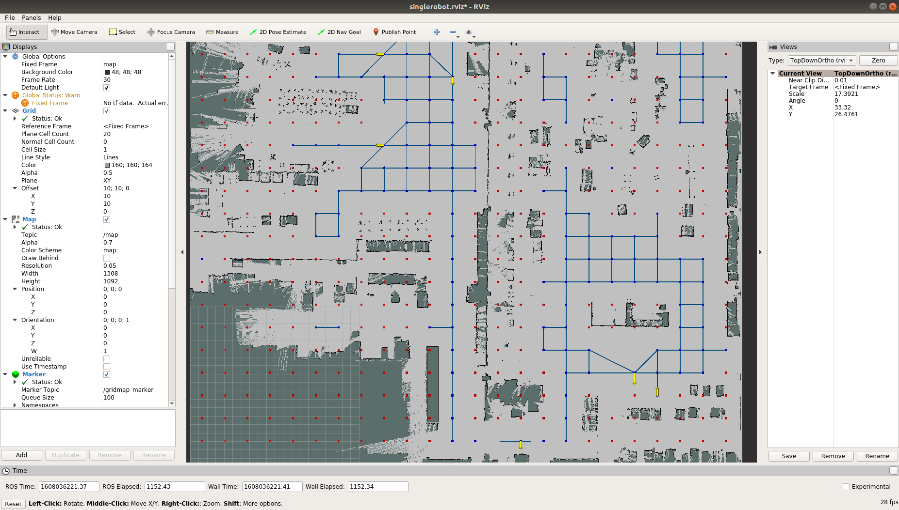
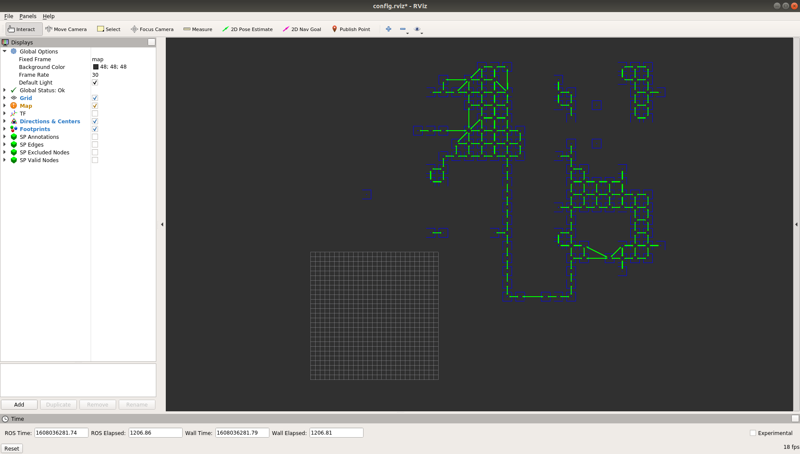
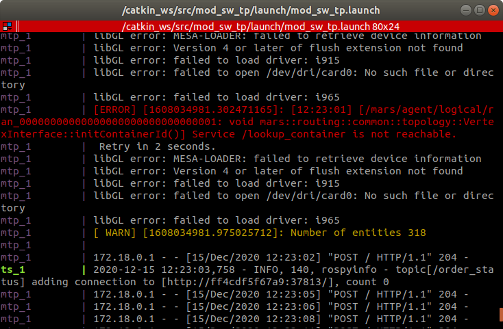
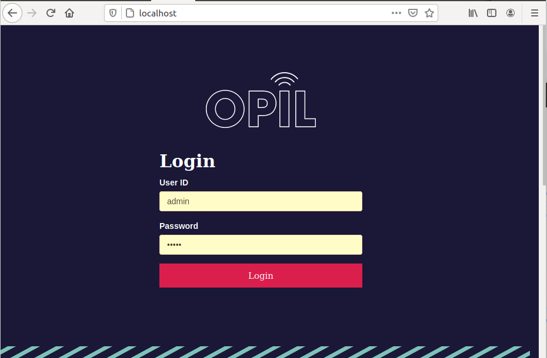
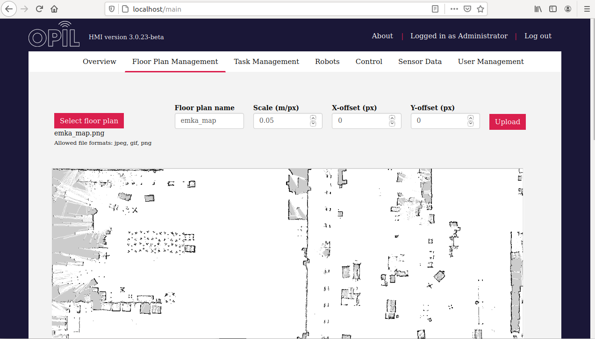
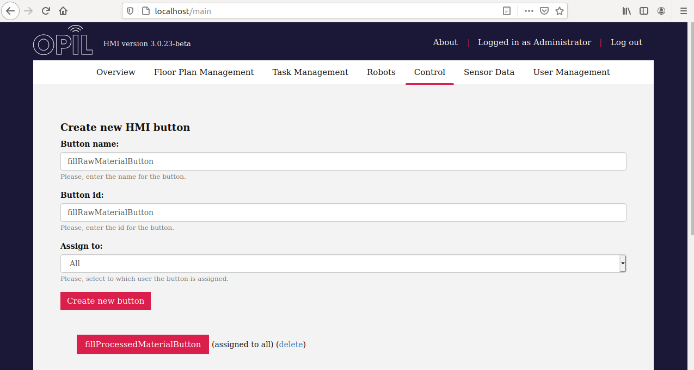
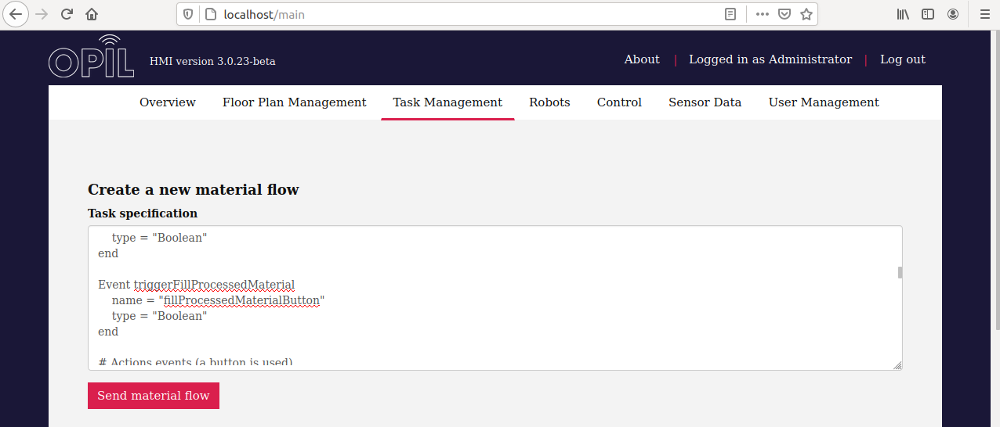

# opil_riogistics

Description: this repository contains the software developed in the L4MS project for the integration of the rbares robot in the EMKA factory using OPIL. 

# Overview

# General Requirements

* Ubuntu 18.04 
* ROS Melodic
* Real or simulated robot
* rbares packages (included as submodule) 
* Docker and docker compose
* L4MS docker images
* Robotnik packages (provided as .deb libraries)


# Main installation

Clone and build this repository in a ROS workspace. This documentation assumes that ```catkin_ws``` workspace has been created in  ```/home``` directory

```
$ cd ~/catkin_ws/src
$ git clone https://github.com/robert-ros/opil_riogistics.git
$ cd ..
$ catkin_make
$ source devel/setup.bash
```


# Packages

## opil_local_server

In this folder the configuration files are provided to start the docker that contains the OPIL Server. 

```
$ cd opil_riogistics/opil_local_server
```

Before to run the docker, set the IP address of the machine where the server will run. Use ```hostname -I``` to get the IP and replace ```<ip-address>``` with that IP in these files:

**docker-compose.yml in lines 58 and 60**

```
    - ocb_host=<ip-address>
    - ocb_port=1026
    - ngsi_proxy_host=<ip-address>
    - ngsi_prox...
```

**firos_config.json in lines 9 and 18**

```
    "contextbroker": {
        "address"   : "<ip-address>",
        "port"      : 1026,
        "subs...

    "endpoint": {
      "address": "<ip-address>",
      "port": 39...
    
```

**ts_fiware_config.ini in line 9**

```
[contextbroker]
host = 192.168.1.14
port = 10...
```

Once configured these files the docker server can be started. Enable xhost to display the windows created by the OPIL server (this step is optional)

```
$ xhost local:root
```

Finally, run the docker

```
$ docker-compose up
```

If everything went well, two rviz windows will display. The first shows the route and the annotations while the seconds shows the footprint of each point of the route.  





Do not worry if MTB shows the following error at first. It means that MTP look the map but can not find because the map is generating still. Eventually MTB will show something like ```mtp_1 | 172.19.0.1 - - [15/Dec/2020 12:24:39] "POST / HTTP/1.1" 204 - ```



To access the HMI open a web browser and introduce the IP of the OPIL Server:

```
http://<ip-address>/main
```

If the OPIL Server and the web browser are running in the same machine, another option is to access the localhost: 

```
http://localhost/main
```

Introduce the following credentials to access as admin

```
admin: admin
password: admin
```



A map is needed to monitor the robots running with the OPIL Server. Go to ```opil_local_server/emka_map.png``` and upload the image into the server.

Use this configuration:
```
Select floor plan: emka_map.png
Floor plan name: emka_map
Scale: 0.05
X-offset: 0
Y-offset: 0
```



In the control tab add the following virtual buttons 

```
- fillRawMaterialButton
- fillProcessedMaterialButton
- loadCompleted
- unloadCompleted
```




Finally, fill inside the Task Management tab the task of the rbares robot. Go to ```opil_local_server/opil_tasks``` and copy-paste it. 

```
# Definitions of the zones

Location pallet_a
    name = "pallet_a"
    type = "SmallLoadCarrier"
end

Location pallet_b
    name = "pallet_b"
    type = "SmallLoadCarrier"
end

Location pallet_c
    name = "pallet_c"
    type = "SmallLoadCarrier"
end

Location pallet_d
    name = "pallet_d"
    type = "SmallLoadCarrier"
end


# Button events

Event triggerFillRawMaterial
    name = "fillRawMaterialButton"
    type = "Boolean"
end

Event triggerFillProcessedMaterial
    name = "fillProcessedMaterialButton"
    type = "Boolean"
end

# Actions events (a button is used)

Event robotLoad
    name = "loadCompleted"
    type = "Boolean"
end

Event robotUnload
    name = "unloadCompleted"
    type = "Boolean"
end


# Orders

TransportOrderStep loadWarehouseOld
    Location pallet_a
    FinishedBy robotLoad == True 
end

TransportOrderStep unloadWarehouseOld
    Location pallet_d
    FinishedBy robotUnload == True 
end

TransportOrderStep loadWarehouseNew
    Location pallet_c
    FinishedBy robotLoad == True
end

TransportOrderStep unloadWarehouseNew
    Location pallet_b
    FinishedBy robotUnload == True
end


# Task 1

task FillRawMaterial
    TriggeredBy triggerFillRawMaterial == True
    Transport
    from loadWarehouseOld
    to unloadWarehouseNew
    OnDone FillProcessedMaterial
end


# Task 2

task FillProcessedMaterial
    TriggeredBy triggerFillProcessedMaterial == True
    Transport
    from loadWarehouseNew
    to unloadWarehouseOld
    OnDone FillRawMaterial
end
```




With these steps the OPIL Server is ready to work with the rbares robot in the EMKA factory.


 ## opil_vtt_server

L4MS has hosted the OPIL Server in a server of VTT Technical Research Center of Finland. Hence, the user does not need have an second machine to deploy and configure the server. Once started, the server will run all the time.

In order to set and run the server the same steps of the ```opil_local_server``` must be followed. Nevertheless, since the OPIL server is in an external machine a SSH connection must done. 

In our case the credentials are the following:

```
IP=130.188.160.88
User: testvmuser
Pass: *******
```

To perform the connection:

```
$ ssh testvmuser@130.188.160.88
```

[IMAGEN AQUI]

## opil_robot

This folder contains the configuration files to start the docker containers that control the AGV using the OPIL Server. The OPIL components involved in this folder are ```RAN``` (robot agent node) and ```Local SP``` (local sensor and perception).

The vast majority of parameters of these files have been set to work with the rbares robot. The only requirement is to set the correct IP of the robot in the network. Go to ```opil_robot/docker-compose.yml``` and edit it. In the line 40 replace ```<ip-address>``` with the IP of the machine where the server is running. In the line 41 replace ```<robot-ip-address>``` with the IP of the robot. 

```
environment:
    - FIWAREHOST=<ip-addres>  # Opil server IP
    - HOST=<robot-ip-addres>  # rbares IP
    - DISPLAY=$DISPLAY
    - SIMULAT...
```

Command ```hostname -I``` returns the IP of the machine.

Once configured the file, the docker can be launched

```
$ docker-compose up
```

[IMAGEN AQUÍ]

If everything went well, the robot position will be displayed on the HMI and the robot will be ready to receive tasks.

[IMAGEN AQUÍ]

Go to the control tab of the HMI and press the ```fillRawMaterialButton``` button. Immediately the rbares robot will start the task. In this case rbares will load a pallet in the warehouse A and takes it to unload it in the warehouse B.

[GIF CARGA/DESCARGA]

[GIF MOVIL ROBOT]

Sometimes If the connection is slow the robot will take time to receive the task from the OPIL Server. One way to know if the robot has stated the task is check the output of the docker container.

[IMAGEN AQUI]

Be careful with the real robot and the wireless connection. If the connection is too slow or even lost the robot will start to move in circles.

[GIF ROBOT EN CIRCULOS]

## opil_robot_vtt

## opil_robot_stageros


## opil_san_sensors
## ros_emka_sensors
## rbares_pallet
## robot_zone_detection 